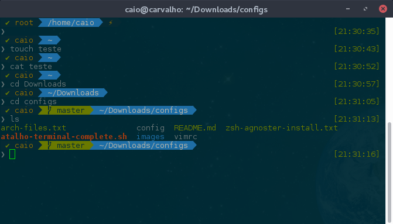

Para quem não conhece, o zsh é um shell alternativo ao bash bastante interessante. Facilmente customizável, com autocomplete, suggestions e temas dos mais variados tipos.

Nesse tutorial mostrarei como instalar o zsh juntamente com o ohmyzsh, o plugin autosuggestions e o tema Agnoster no Debian.

Primeiramente faça a instalação do zsh através do comando:

sudo apt-get install zsh

Instale o ohmyzsh:

sh -c "$(curl -fsSL https://raw.github.com/robbyrussell/oh-my-zsh/master/tools/install.sh)"

Defina o zsh como o seu shell principal:

chsh -s /bin/zsh

Configure as fontes:

wget https://github.com/powerline/powerline/raw/develop/font/PowerlineSymbols.otf
wget https://github.com/powerline/powerline/raw/develop/font/10-powerline-symbols.conf
mv PowerlineSymbols.otf ~/.fonts/
mkdir -p .config/fontconfig/conf.d
fc-cache -vf ~/.fonts/
mv 10-powerline-symbols.conf ~/.config/fontconfig/conf.d/

Faça as alterações de tema e de usuário principal em seu arquivo .zshrc:

vim ~/.zshrc
ZSH\_THEME="agnoster"
DEFAULT\_USER=usuario

Instale o Solarized:

git clone git://github.com/sigurdga/gnome-terminal-colors-solarized.git ~/.solarized
cd ~/.solarized
./install.sh
wget https://raw.githubusercontent.com/seebi/dircolors-solarized/master/dircolors.ansi-dark
mv dircolors.ansi-dark .solarized

Adicione a seguinte linha ao final de seu .zshrc:

eval `dircolors ~/.solarized/dircolors.ansi-dark`

Para habilitar o plugin de autosuggestions, clone o seguinte repositório:

git clone git://github.com/zsh-users/zsh-autosuggestions ~/.zsh/zsh-autosuggestions

Em seguida adicione a seguinte linha ao seu .zshrc:

source ~/.zsh/zsh-autosuggestions/zsh-autosuggestions.zsh

Copie o conteúdo para a sua pasta root:

su
cp -r /home/usuario/.zsh\* /root/
cp -r /home/usuario/.solarized /root/
chsh -s /bin/zsh

Pronto, agora basta reiniciar o seu sistema e o zsh já estará habilitado como o seu shell padrão.

