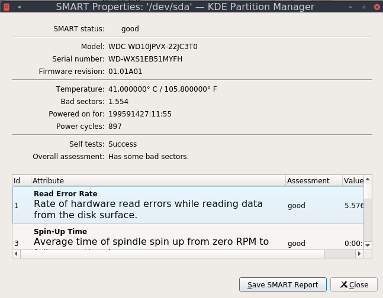

Olá,

estou começando a escrever esse texto como uma forma de deixar um relato sobre minha experiência no _Season of KDE_, mostrando o quão interessante esse tipo de experiência pode ser para aqueles que têm interesse em começar a conhecer a respeito de software livre ou colaborar em um projeto de alguma comunidade.

Para quem não conhece, o _Season of KDE_ é um projeto promovido anualmente pela comunidade KDE, cuja ideia é similar a proposta do _Google Summer of Code_, onde é oferecida a oportunidade para que qualquer pessoa, não somente estudantes, participem em projetos que beneficiem o ecossistema da KDE, tanto em produção de código como em outras áreas.

Inicialmente tive a oportunidade de conhecer a respeito da comunidade com alguns colegas de faculdade que já colaboram ativamente com SL há algum tempo. No entanto, nessa época eu ainda seguia aquela velha desculpa de não me sentir "programador suficiente" para colaborar e participar em algum projeto, mesmo tendo bastante interesse de aprender e fazer parte.

Porém, esse semestre tive a oportunidade de conhecer o professor Sandro Andrade, que é um membro ativo na comunidade e costuma discutir em algumas aulas a respeito de software livre e o KDE. Ele nos mostrou em sala a respeito do _Season of KDE_ e sobre como participar. Foi então que percebi que aquela era a oportunidade para que eu pudesse tomar coragem e começar a colaborar de alguma forma. Como grande parte dos projetos do KDE são escritos em C++ e Qt, vi que essa também seria uma boa oportunidade para que eu pudesse consolidar os meus conhecimentos nessas habilidades.

Entrei em contato com alguns mantenedores de projetos e decidi colaborar no _KDE Partition Manager_. O projeto é todo feito em C++ (minha atual linguagem favorita) e Qt. Submeti uma proposta para colaborar na atualização do suporte ao [SMART](https://en.wikipedia.org/wiki/S.M.A.R.T.), que é uma ferramenta de monitoramento de discos capaz de detectar falhas e criar relatórios com vários indicadores de estado dos discos, possibilitando a antecipação de possíveis danos futuros.

O principal detalhe da atualização envolve uma migração do código que utilizava a [libatasmart](http://git.0pointer.net/libatasmart.git/), uma biblioteca escrita em C capaz de fornecer acesso às funcionalidades do _SMART_. Essa biblioteca já não é mantida há alguns anos e o _kpmcore_ (core do _KDE Partition Manager_) precisava dessa mudança. Conversando com Andrius Stikonas, o mantenedor do projeto, descobri que a nova versão do _smartctl_ (ferramenta de CLI para gerenciar o _SMART_) irá receber uma atualização em que será possível obter um output dos dados do _SMART_ em formato json, o que torna fácil realizar uma conversão desses dados com Qt para o kpmcore.

Foi então que escrevi a minha proposta, que você pode ver aqui (ignorem o inglês ruim, estou me esforçando para melhorá-lo, hahaha): https://drive.google.com/file/d/1SYSRUaek43i9wYN32HiFL8\_mENqXaz1l/view?usp=sharing

Logo depois, descobri que minha proposta foi aceita e comecei a trabalhar no projeto, que iniciou na semana passada. Durante essa semana, realizei as seguintes coisas:

- Estudei como o _SMART_ funciona e como a antiga _libatasmart_ realizava o acesso às suas funcionalidades.
- Conversei com o mantenedor sobre alguns detalhes do acesso ao json do _smartctl_ (como por exemplo utilizar o wrapper _ExternalCommand_ do _kpmcore_ para executar e acessar processos externos do sistema, ao invés de utilizar _QProcess_, que era o que eu pensava em fazer no início).
- Criei um conjunto de classes (_SmartParser_, _SmartDiskInformation_ e _SmartAttributeParsedData_), cujas funcionalidades são a de gerenciar o acesso ao conteúdo do json e que podem ser descritas da seguinte forma:
    - _SmartParser_: Responsável por executar e recuperar o output do _smartctl_, fazendo com que a classe _SmartStatus_ (que antes acessava a _libatasmart_) tenha acesso a esses dados.
    - _SmartDiskInformation_: Representa todas as informações do disco providas pelo _SMART_, incluindo uma lista com os seus atributos, onde cada um deles é encapsulado em _SmartAttributeParsedData_.
    - _SmartAttributeParsedData_: Representa um atributo _SMART_ com um conjunto de dados de estado do disco como temperatura, setores defeituosos, tempo de funcionamento, entre outros. Cada um desses atributos tem uma identificação própria e existem alguns que são próprios de determinados fabricantes, como você pode ver nesse [link](https://en.wikipedia.org/wiki/S.M.A.R.T.#ATA_S.M.A.R.T._attributes).
- Fiz as implementações necessárias e corrigi alguns pequenos erros.

Agora estou realizando alguns testes e começando a trabalhar na documentação do que foi feito. O relatório do _SMART_ está sendo gerado corretamente pelo _Partition Manager_:

Como essa primeira parte foi bastante simples e estou concluindo bem rápido, estarei colaborando na outra parte do projeto do _kpmcore_ que envolve uma atualização na forma como o _KAuth_ é invocado.

Enfim, irei continuar minhas atividades do _SoK_ durante próximas semanas. Espero que esse texto inicial sirva de incentivo para aqueles que querem começar a colaborar, mas que enfrentam o mesmo tipo de problema que eu enfrentava, sabendo que no SL existem várias formas de se dar o ponta-pé inicial para quem quer começar.
