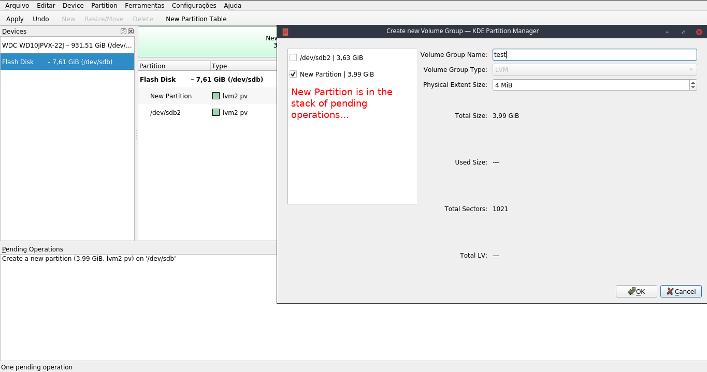
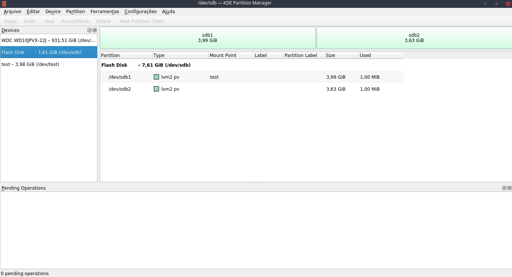

Hello!

I have been selected to participate in Google Summer of Code 2018, where I will collaborate in KDE Partition Manager and Calamares under KDE Community. My proposal involves finishing the LVM support and implementing RAID support in kpmcore, KDE Partition Manager and Calamares. For those who want to know more details about it, here is my [proposal link](https://docs.google.com/document/d/1gpa1TDob0rN6JDd7sXfRIpE1x7DiQcpZyCaXd01MtHg/edit?usp=sharing).

I have been collaborating to kpmcore and KDE Partition Manager since January of this year, where I had the opportunity to participate in Season of KDE, as you can see in this [post](https://caiojcarvalho.wordpress.com/2018/01/09/season-of-kde-introducao-e-primeira-semana/) (in portuguese) and this [status report](https://community.kde.org/SoK/2018/StatusReport/CaioJordaoCarvalho) (in english). There I had the opportunity to replace unmaintained SMART support to calling smartctl command in KDE Partition Manager. It was a great experience for me to participate in this project and it motivated me to continue communicating with Andrius Stikonas (kpmcore and KDE Partition Manager maintainer) to help in some other kpmcore fixes and features, specially with the improvement of KAuth support.

When student application period started in GSoC, I saw that this was another opportunity to continue contributing in another great feature in KPM, then I submitted my proposal and got succesfully accepted. :)

GSoC started in April 23th and we are currently in Community Bonding period until May 14th. This period is focused in connecting the student more with his organization, provinding a time to learn more about it and getting more involved. I've been in communication with my mentors (Adriaan de Groot and Andrius Stikonas) to start planning some goals and learn more about the codebase of KDE Partition Manager and Calamares. I'm getting more familiar with partitioning module in Calamares and LVM routines in KDE Partition Manager.

Furthermore, I'm focusing in fixing some bugs and implementing some features related to LVM support. You can see one PR that I've made to Calamares [here](https://github.com/calamares/calamares/pull/945).

The first goal of my project aims to finish LVM support in Calamares, that involves implementing the support to the process of creation, removal and resizing of LVM volume groups. I'm studying how LVM VG creation dialog works in KDE Partition Manager and how I can port it to Calamares. I've already solved some bugs in KPM, including one that is related to list LVM physical volumes that are waiting to be created at the VG dialog, as you can see here:

_Image 1: New Partition (that is a LVM PV) being listed in LVM VG creation dialog._

_Image 2: After creating the VG (which I called as test) containing New Partition (that now received /dev/sdb1 name)._

There were some other minor fixes related to the process of LVM VG that I'm working to fix as you can see in these commits:

- \[ Including CreateVolumeGroupOperation::targets(const Partition&) implementation. \] - https://cgit.kde.org/kpmcore.git/commit/?h=kauth&id=34cfc63da48dd57ded0815a28bd2f94ef55a94c1
- \[ Allow creating LVM VG with PVs that are going to be created in OperationStack; Check if there is another CreateVolumeGroupOperation with the LVM PV before listing it in the LVM VG creation widget; Disallow creating VG with some PV that will be deleted. \] - https://cgit.kde.org/partitionmanager.git/commit/?h=kauth&id=af9fbe8a4ff273f85a874d3f33195aa5b6a166e0
    

And about the implementation of RAID support, I'll take advantage of this first GSoC period to study more about [_mdadm_](https://linux.die.net/man/8/mdadm) tool, that will help me in the process of manipulation of RAID devices.

I'm going to keep communicating in this blog about my GSoC experiences and any other progress during this project. See you later!
