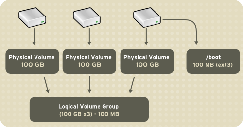
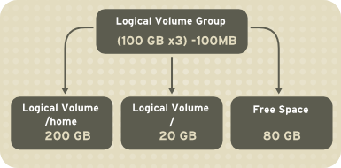
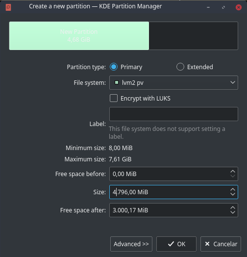
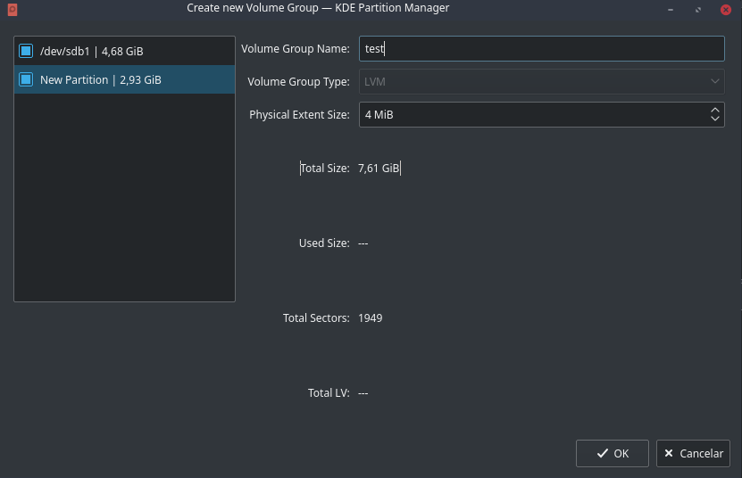
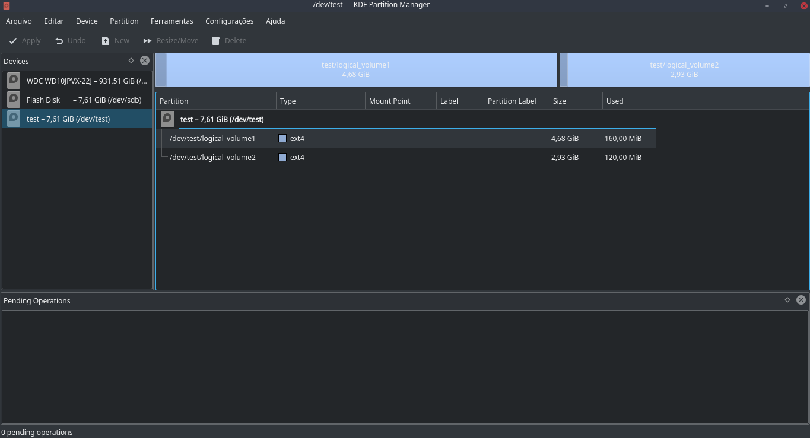
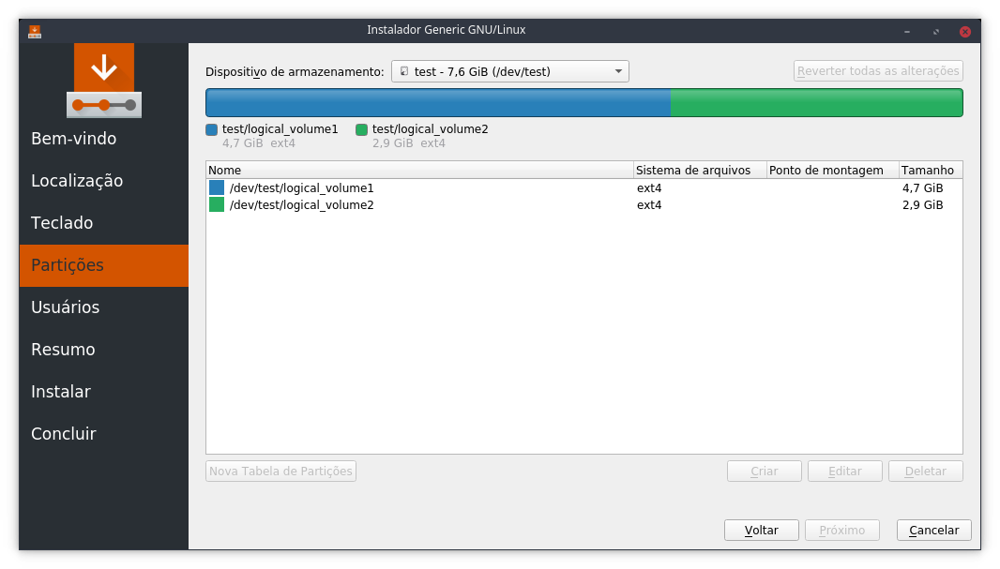

Hello!

As I said in my previous [post](https://caiojcarvalho.wordpress.com/2018/05/04/google-summer-of-code-2018-introduction-community-bonding/), I'm using this community bonding period to understand how LVM works in kpmcore. It involved studying about how the three parts of LVM (Physical Volumes, Volume Groups and Logical Volumes) work in the library and how this logic was implemented.

In this text, I'm intending to give a short explanation about LVM, discuss about some plannings related to the process of creation of LVM VGs in Calamares and talk about some corrections related to it that I've implemented in kpmcore and KDE Partition Manager.

## LVM - Logical Volume Management

### Concepts

LVM, or Logical Volume Management, is a storage device management tool that provides some services related to the processes of allocating disks, striping, mirroring and resizing logical volumes. With this tool, a HD or set of HDs can be allocated to one or more physical volumes. These physical volumes can be combined into volume groups that can be interpreted as logical devices, providing a way to create logical volumes (or logical partitions) inside them. When these LVs reach their full capacity, free space from the VG can be provided to increase the logical volume size and when a new HD is added to the system, you can add it to the volume group.

_Image 1: Volume Group created with 3 PVs of 100GB each (but its created with -100MB because the last device has a physical partition of this size)._

_Image 2: Logical Volumes created inside of the LVM VG._

### Functionalities that are already implemented

Well, kpmcore actually offers full support to the process of manipulation of LVM volumes. In KDE Partition Manager, LVM PVs can be created through the New Partition dialog, including the process of encryption with LUKS.

_Image 3: Creation of LVM PV in KPM, with the checkbox to encrypt it with LUKS._

These PVs can be associated to a VG through the New Volume Group dialog, which allows to choose the LVM partitions that will make part of the group.

_Image 4: Creation of LVM VGs through New Volume Group dialog in KPM._

And after creating this group, it will be showed in devices list, which will list its logical volumes after selecting it. Actually Calamares only doesn't offer support to the process of creation of LVM VGs, but these groups can be listed as devices, which allows to create logical volumes in it.

_Image 5: Logical Volumes inside the LVM VG called "test" in KPM._

_Image 6: Logical Volumes inside the LVM VG called "test" in Calamares._

So what I'm initially planning to do is create one button in the Partition page (showed in _Image 6_) of Calamares, that will redirect the user to a dialog to create a new LVM VG. This logic will be similar to the one that can be visualized in New Volume Group dialog in KPM. I'll understand the operation process in Calamares, because it's quite different from KPM and it doesn't work with a stack of pending operations.

## Latest fixes in LVM support at KPM and kpmcore

As a way to better understand how LVM support works in KPM and kpmcore, I've been implementing some fixes to these processes, that will be listed below (with commit links).

### 1\. List newly created LVM PVs that are encrypted in Volume Group creation dialog.

The user should be allowed to add newly created LVM PVs that are encrypted. As you can see in this [commit](https://cgit.kde.org/partitionmanager.git/commit/?h=kauth&id=af9fbe8a4ff273f85a874d3f33195aa5b6a166e0), I've just implemented support to the inclusion of unencrypted LVM PVs and it was needed to implement to the ones encrypted with LUKS as well.

Some commits:

\[ Listing newly created encrypted LVM PVs in Create Volume Group dialog \] - https://cgit.kde.org/partitionmanager.git/commit/?h=kauth&id=7d5d1f8f8a1d88bb033fbf147baf20d8c851b729

### 2\. Don't allow to grow, shrink or move newly PVs that will be added to newly VGs.

This bug was mainly related to the functionality of OperationStack. After allowing to add newly PVs to newly VGs, the OperationStack would be in this order:

- Creation of LVM PV.
- Creation of LVM VG containing the PV created above.

But if you tried to add a new resize operation targeting that PV (i. e. grow, shrink or move), it removes the creation operation of its position and push a new one to the stack, setting it after the VG creation and causing this bug. As it should be tricky to change how OperationStack works, I talked to Stikonas about it and we decided to keep for a while a verification that will see if this newly Partition is part of a newly VG. Also I need to understand how this process works in Calamares, because it apparently doesn't use an OperationStack, as I said before.

Some commits:

\[ partitionmanager: Don't delete, shrink or move LVM PVs that are being targeted by CreateVolumeGroupOperations \] - https://cgit.kde.org/partitionmanager.git/commit/?h=kauth&id=556a5a22ba41643d324452a884cda25bab40b65e

\[ partitionmanager: Passing list of pending operations as argument to ResizeOperation::canGrow; Access LVM::pvList through static list attribute \] - https://cgit.kde.org/partitionmanager.git/commit/?h=kauth&id=dfca46250e5ea5261d66e44223500cf1b94bdcb6

\[ kpmcore: Refactoring LVM::pvList to be a class with static QList<LvmPV> attribute instead of extern instance; Moving LVM VG verification in canShrink, canMove, canGrow to isLVMPVinNewlyVG method at ResizeOperation; Don't grow LVM PVs that are being targeted by CreateVolumeGroupOperations \] - https://cgit.kde.org/kpmcore.git/commit/?h=kauth&id=9e6cf4063a29dd13fafed939e2ee4ae3061a37d6

\[ kpmcore: Including vgName in CreateVolumeGroupOperation description; Don't delete LVM PVs that are being targeted by CreateVolumeGroupOperations; Don't shrink or move LVM PVs that are being targeted by CreateVolumeGroupOperations \] - https://cgit.kde.org/kpmcore.git/commit/?h=kauth&id=1e95d01923e7d363ea7fe6e68d5280ec58bc64ef

## Conclusion

Community Bonding period is almost finishing, but I'll write another post about it before that, talking a little bit about my final ideas about the implementation before starting the coding period. See you later!

## References

\[1\] J. Ellingwood, "An Introduction to LVM Concepts, Terminology, and Operations", 2016. Available: https://www.digitalocean.com/community/tutorials/an-introduction-to-lvm-concepts-terminology-and-operations.

\[2\] "LVM", 2018. Available: https://wiki.archlinux.org/index.php/LVM.

\[3\] "What is LVM?", 2018. Available: https://www.centos.org/docs/5/html/5.1/Deployment\_Guide/s1-lvm-intro-whatis.html.
