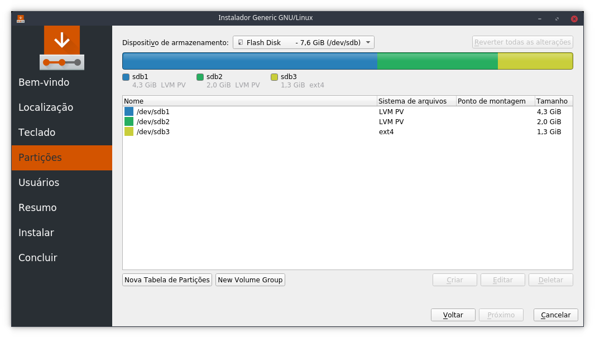
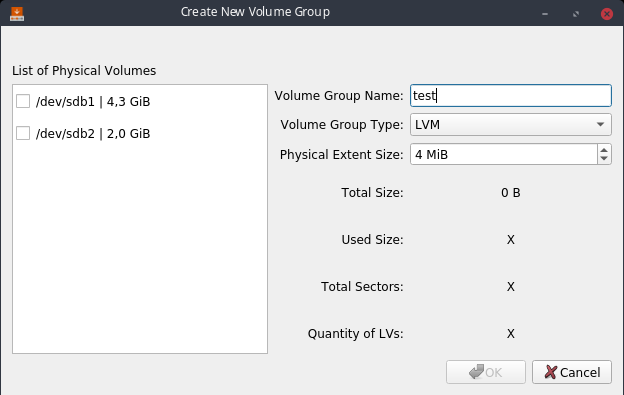

Hi, everyone!

Coding period has finally started and I had done some work in the implementation of LVM Volume Groups creation in Calamares. In this post, I'll explain how I have implemented it and how my work is progressing until now.

## LVM VG creation GUI

As I said [here](https://caiojcarvalho.wordpress.com/2018/05/12/google-summer-of-code-2018-community-bonding-part-3-management-of-lvm-vgs-in-calamares/), I planned to create a button to access LVM VG creation GUI in Partition page in Calamares.  This GUI should work in a similar way to the LVM VG creation GUI as seem in KDE Partition Manager. Also it was needed to create some VG widget hierarchy to reuse in other processes (i.e. resize LVM VGs and RAID operations).

_Image 1: Partition page in Calamares. Look the "New Volume Group" button._

_Image 2: Create New Volume Group GUI in Calamares._

This interface is responsible to create LVM Volume Groups with the selected LVM PVs. After this process, the new LVM VG will be created and now you can create new LVM Logical Volumes in it.

## New Classes

There are some brief descriptions about the new classes involved in this process:

- partition/jobs/CreateVolumeGroupJob: Calamares::Job to create new VGs. I'm planning to create a VolumeGroupJob hierarchy, as seem in PartitionJob.
- partition/gui/VolumeGroupBaseDialog: Base dialog to Volume Group operations.
- partition/gui/CreateVolumeGroupDialog: Dialog to create Volume Groups. It derives from VolumeGroupBaseDialog.
- partition/gui/ListPhysicalVolumeWidgetItem: QListWidgetItem made to store a physical volume reference.

## Conclusion

I need to do some fixes before proceeding to the other goals of this project. I'm planning to create the resize VG GUI during this week and try to improve some things in the code that I already created before pushing it to my branch and making a PR to Calamares. I've created a video showing these initial implementations, as you can see here:

 

https://www.youtube.com/watch?v=eCNigHeB7sU

_Video 1: Google Summer of Code 2018 - Initial implementation of LVM VG creation in Calamares_

Until the next post. :)
