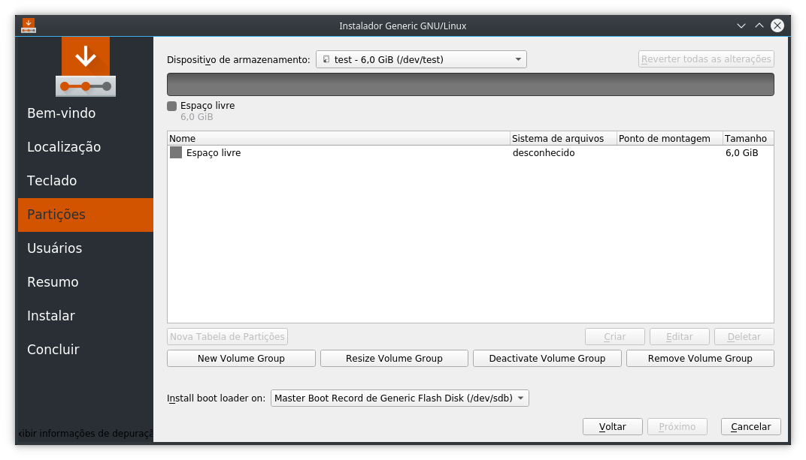
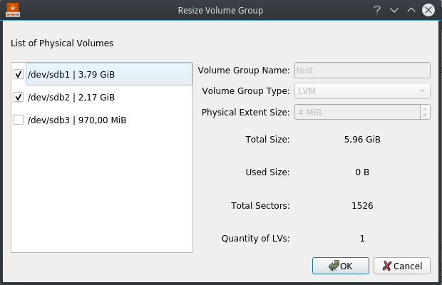
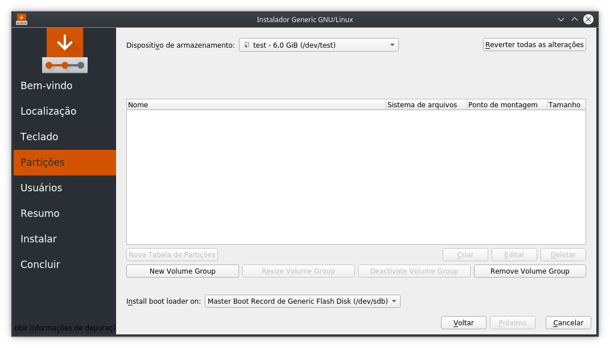

Hi!

I got some good news to tell in this post, but it will be a brief report about it all.

I've finished LVM VG complete support to Calamares, including resize, deactivate and remove operations. All my progress is actually related to my PR from the last week (I've changed it's name, because I decided to include the remaining LVM implementations on it). This PR got some dependency issues with kpmcore's latest versions and the code needs some refactoring, but you can see it here:

[\[partition\] Finish LVM Volume Group support](https://github.com/calamares/calamares/pull/984)

I've changed Calamares' Partition Page to include a group of buttons related to VG operations. Now there is a row reserved for it, organized in a horizontal layout. I'll talk more with Andrius and Adriaan (my GSoC mentors) about these buttons positioning.

_Image 1: Calamares Partition Page with the button group for VG operations._

Here is a brief description about each of these VG operations:

## Resize Volume Group

It loads a GUI (which inherits from VolumeGroupBaseDialog, so it's similar to the CreateVolumeGroupDialog GUI), containing all the PVs from the selected device and the available (i.e. unused) LVM PVs from the system. Then the user can select between the available partitions to grow or shrink the LVM VG.

_Image 2: Resize Volume Group GUI._

## Deactivate Volume Group

This process unloads the partition model of the current LVM VG device, releasing each one of its LVs. It can be used when you got some logical volume (LV) on your VG, but wants to remove this VG. This job is called immediately (i.e. it will not be queued on JobQueue) and you can remove your VG after deactivation.

_Image 3: "test" VG after deactivating it._

## Remove Volume Group

You can remove your VG in two cases: if you deactivated it or if you haven't created any logical volume on it. After choosing this operation, it will enqueue a remove volume group job to the pending jobs list.

# Conclusion

I started my studies about the RAID implementation during this week. First, I'll be working on the kpmcore implementation, using the [raid-support branch](https://git.stikonas.eu/andrius/kpmcore/src/branch/raid-support). I'll write some more detailed posts about RAID during the next weeks.

See you later! :)
