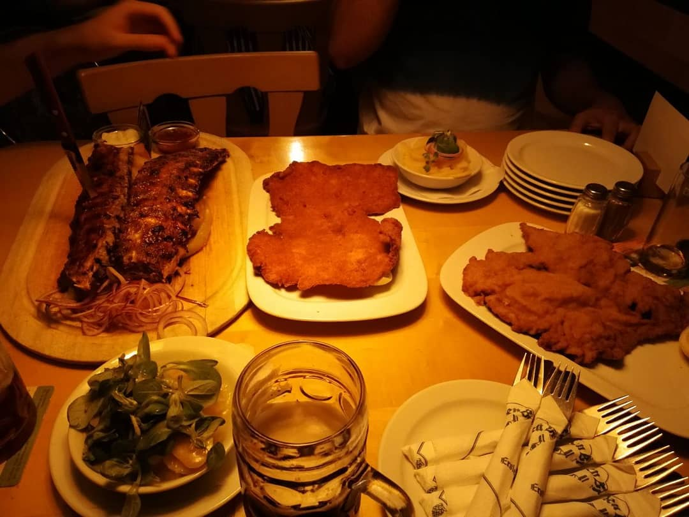
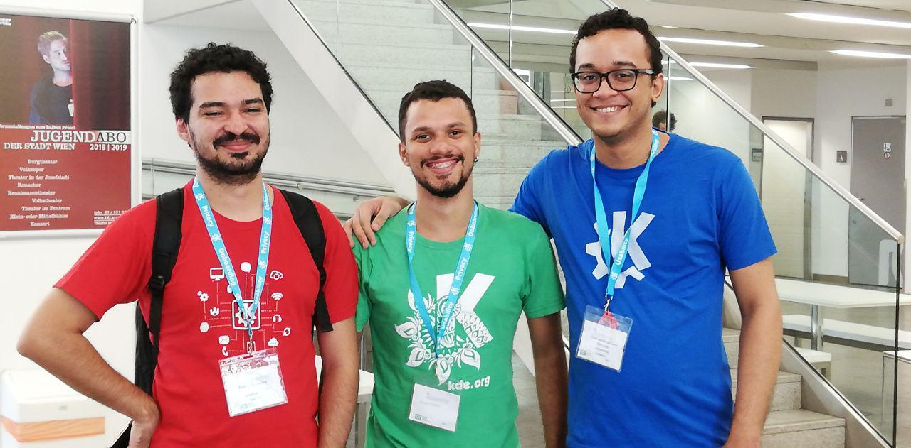
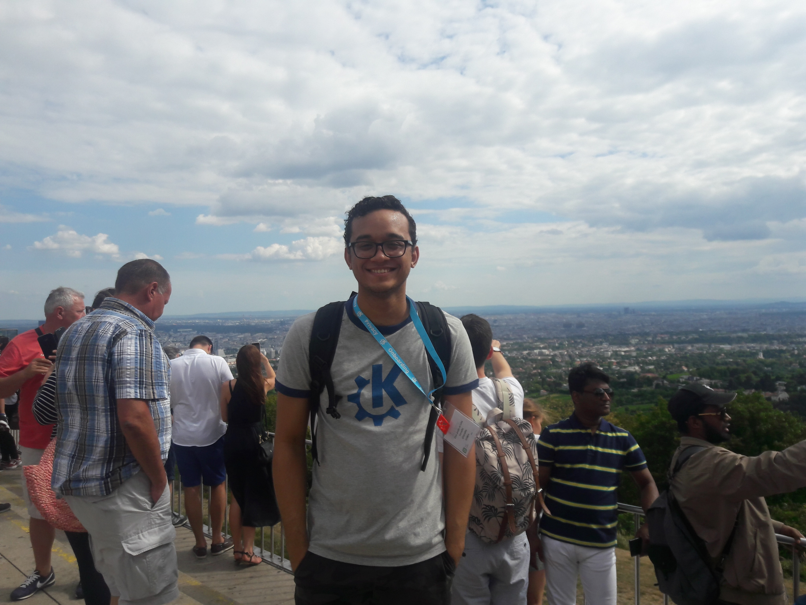

Hello!

So Akademy 2018 has finished and it was a very impressive event. It happened in Vienna, Austria and it was my first opportunity to join in a KDE event, to travel to another country and to meet people from the community!

I couldn't participate during the first day of the event (August 11th) because my flight delayed a little bit and I only arrived in Vienna by night. So in the first day I only had the opportunity to join the people for a drink and prove some Wiener schnitzel and food from Austria.

\[caption id="attachment\_812" align="aligncenter" width="1080"\] _Yummy!_\[/caption\]

In the second day I could watch some talks and presentations, meet some people from KDE, including Adriaan de Groot, that was one of my GSoC 2018 mentors. This was the first time that I've talked with him personally and he is a very nice person. We discussed about my GSoC project and some future implementations for Calamares. It was nice to meet you, Ade!

\[caption id="attachment\_813" align="aligncenter" width="1280"\] _The brazilian RGB (Filipe, Eliakin and I)._\[/caption\]

There were some Birds of Feather (where the Akademy attendees group together based on a shared interest and carry out discussions), workshops and meetings on the remaining days of the event. I got the opportunity to participate in some of them and even suggested and helped in coordinating one BoF about Google Summer of Code and Season of KDE programs. It was pretty nice to meet the GSoC/SoK admins and the other students, and to know a little bit about how they went through their projects during this year.

\[caption id="attachment\_820" align="aligncenter" width="6000"\] _KDE Brasil._\[/caption\]

I also hacked kpmcore/partitionmanager/Calamares a little bit and submitted some patches. Now partitionmanager can create RAID! I could work on this improvement and fixed some minor issues related to the RAID array visualization. Also helped in solving some bugs related to the KAuth patch in kpmcore, which where happening during kpmcore backend change through KDE Partition Manager.

Vienna is a very beautiful city with an amazing food (which is very different from the brazilian, by the way). I learned some basic german words, visited some places and learned about the city's history. Kahlenberg has one of the most beautiful views that I could ever contemplate.

\[caption id="attachment\_806" align="aligncenter" width="4096"\] _Daytrip in Kahlenberg._\[/caption\]

This is it! Hope to see you soon, people from KDE around the world! I will miss you all and the city of Vienna a lot. :)
