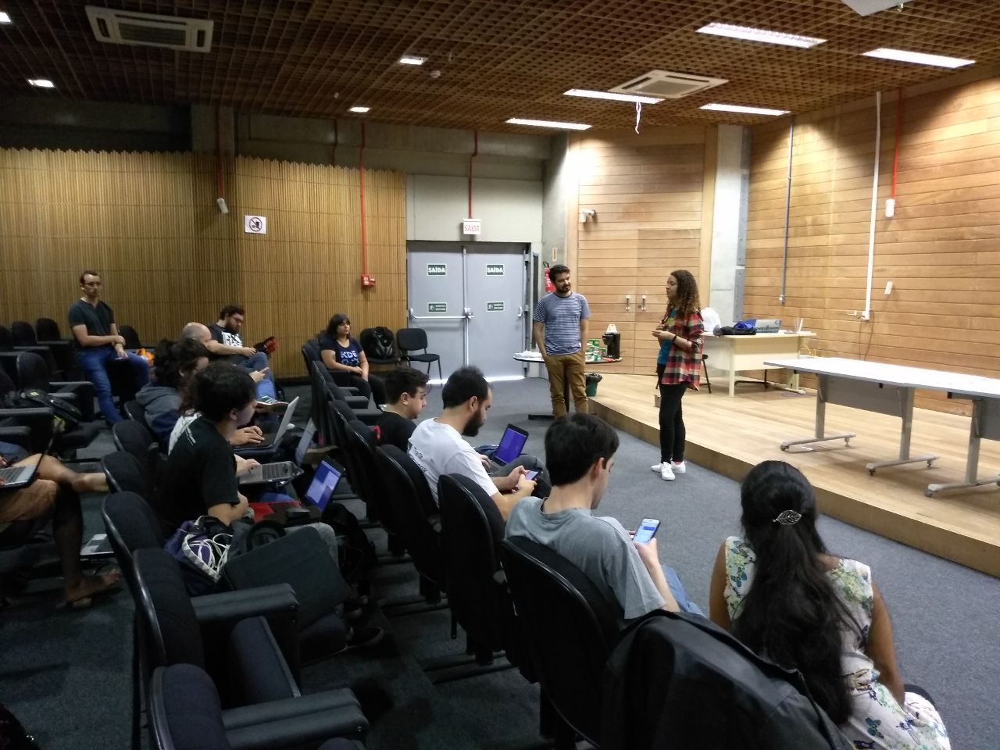
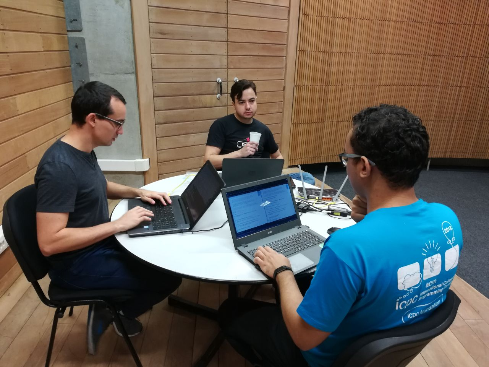
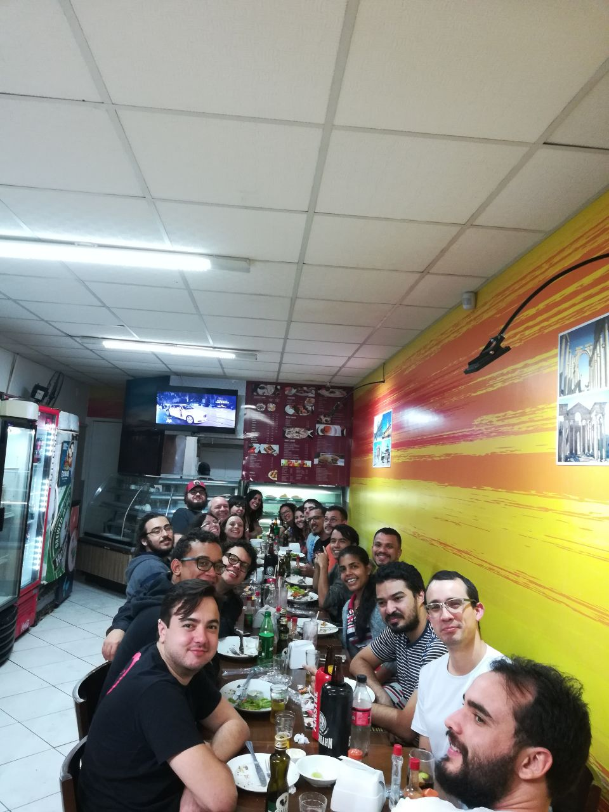

LaKademy 2018 has started!

It is happening in the city of Florianópolis in Brazil. It is being a nice opportunity for me to meet some other KDE contributors from Latin America. We are discussing ideas for KDE in Latin America and everybody is working on something related to the community. The event will continue until October 14th. Below you can see some photos:

\[caption id="attachment\_854" align="aligncenter" width="1280"\] _Aracele and Filipe talking about the event._\[/caption\]

\[caption id="attachment\_856" align="alignnone" width="1280"\] _Coding and sharing ideas with Dórian and Pedro._\[/caption\]

\[caption id="attachment\_855" align="alignnone" width="960"\] _Enjoying some arab food._\[/caption\]

I am enjoying this time to discuss with some older contributors and to share ideas with newer contributors. I am also submitting some patches to KDE Partition Manager. Here is a brief list of what I have done to KDE Partition Manager in this first day of LaKademy:

- Corrections for SoftwareRAID, including the process of loading physical volumes instances for the device object.
- Support to RAID activation through GUI. Before you could only activate RAID through the process of disk rescanning. Maybe I can also implement this functionality for LVM as well in the future.
- Support to remove a RAID device from mdadm.conf file, allowing the user to remove inactive RAID devices. There is a particular bug in this process, because after creating a new RAID device with the same physical volumes contained in a deleted device, the device mapper is identifying the old partition table. I must look if only erasing each physical volume superblock solves it or if I need to erase the RAID partition table before erasing the device.

Well, this is it for now. We started the second day and tomorrow I will be posting more about what I have been working. :)
