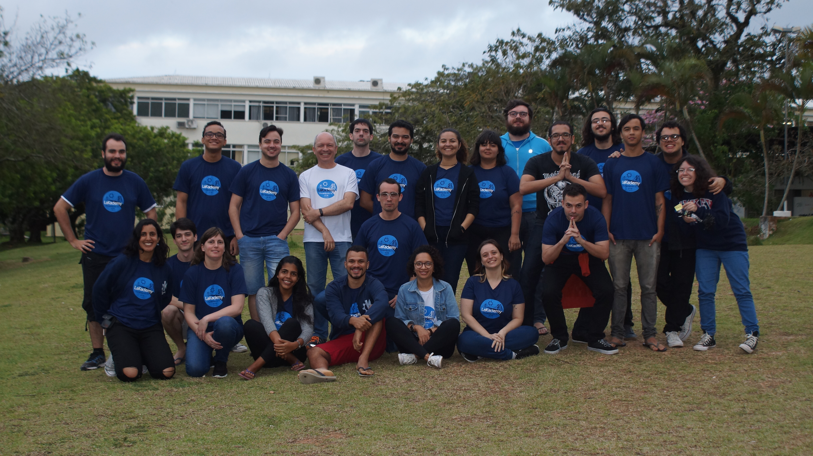

Every new code follows new bugs. During the second day of LaKademy I was more focused on resolution of bugs in the code that I implemented during the first day for KDE Partition Manager. During the afternoon, I decided to start RAID resizing and discussed with Andrius Stikonas on calamares IRC channel about some RAID functionalities related to resizing disks and about bugs on both LVM and RAID. I also talked with some KDE coders here in LaKademy about Qt and C++, learning more about it.

\[caption id="attachment\_863" align="aligncenter" width="4032"\] _Image 1: Concentrated while coding._\[/caption\]

Also we took some group photos. It was very nice to participate.

\[caption id="attachment\_865" align="aligncenter" width="4912"\] _Image 2: LaKademy 2018 group photo._\[/caption\]

And here is a more precise list of what I have done on coding and some things that I am planning to complete during the third day:

- Solved that bug commented in this [post](https://carvalho.site/2018/10/12/lakademy-2018-first-day-october-11th/), where the device mapper identifies an old partition table from a deleted RAID device that contains the same physical volumes as a newer one. Actually I don't know if udev has some method to clear it when removing a logical device, but I decided to erase the partition table from the deleted device just before deleting it.
- Fixed some segfaults when rescanning LVM and RAID. This bug was my fault (shame!), I forgot to check if a logical device contains a partition table when updating the partition nodes information.
- Started the implementation of RAID resizing. I focused on adapting the LVM GUI, using VolumeManagerDevice references instead of LVM directly, to provide adaptation for all the possible logical volumes resizing in the future. I will continue working on this resizing implementation during the third day.

The third day of LaKademy 2018 will be my last day here in Florianópolis. I will be traveling back to Salvador (my city) in the morning of October 14th, because I need to do another travel on October 15th to an event related to the university. I will continue enjoying LaKademy during this last day, it is being great! :)
