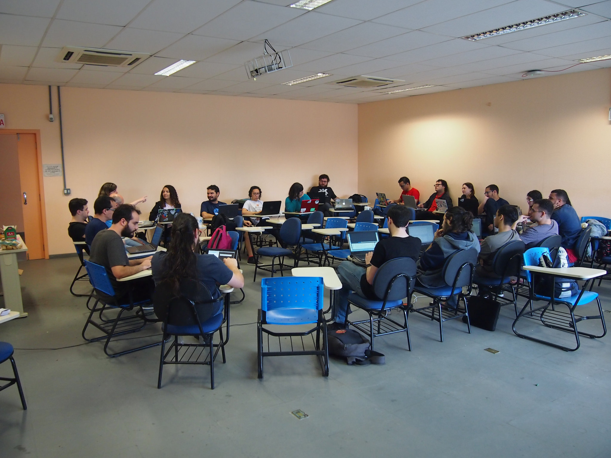
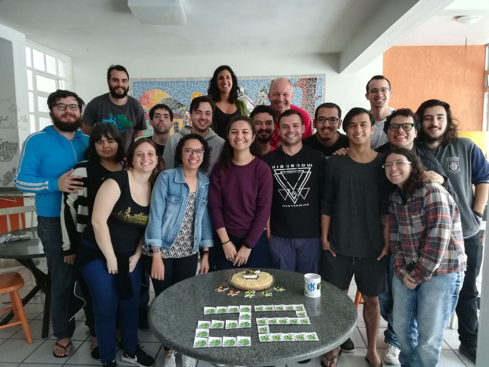

The third day of LaKademy 2018 was my last day participating on the event.

During October 13th, we started the day with a promo reunion. This reunion was done to discuss about some plans and actions for the Latin American KDE community over the next year. Some decisions were made and topics were discussed involving KDE participation in some events, promotion of our own events in Latin America, including LaKademy 2019 and Kafé com Qt, and some details in general about our community.

\[caption id="attachment\_872" align="aligncenter" width="679"\] _Promo reunion._\[/caption\]

After the promo reunion, I decided to build and take a look at the code of Atcore, which is a library containing the main components for the Atelier, that is an Open Source 3D printing application developed by KDE Community. I noticed that most of the enums used in src/core/atcore where not determined by its scope, which maybe could generate an enum name conflict in the future. So I decided to contribute with this little change, adapting the code to reference enums as C++11 scoped enums, providing assistance to the possible name conflicts.

During the afternoon, I continued my work in KDE Partition Manager, implementing that RAID resize functionality in kpmcore, where I decided to include the operations of growing and shrinking of RAID disks. Then, I fixed some bugs in the creation of RAID 1, 4, 5, 6 and 10, because a check-up was being done by mdadm before mirroring the devices and my previous implementation was ignoring it. This mdadm check was necessary to confirm which device size should be prevailed before mirroring.

\[caption id="attachment\_873" align="aligncenter" width="676"\] #KDEis22\[/caption\]

I had to come back to my city during the morning of October 14th. In this date the anniversary of 22 years of KDE was celebrated. The KDE people that continued in Florianópolis decided to eat a cake to celebrate. I couldn't participate, but I am very happy to be part of this inspiring community. Happy birthday, KDE! I hope that this great community keeps succeeding over the years to make the world a better place with its great software! #KDEis22 :)
