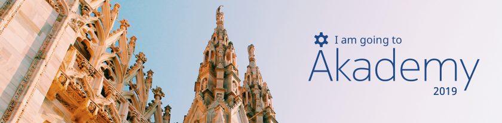

  This year I will be going to my second [Akademy](https://akademy.kde.org/2019) to meet my KDE friends again, discuss about future plans for the community during BoF sessions, participate in workshops, code and learn more about free software, KDE projects and Qt! One more interesting thing is that this time I am going to present a talk about our new features in kpmcore library because of the release of KDE Partition Manager 4.0.

The conference will be happening in Milan, Italy between September 7th and 13th. If you are around this city during this period and want to know about our community, please feel free to join us. Make your registration [here](https://akademy.kde.org/2019/register).
