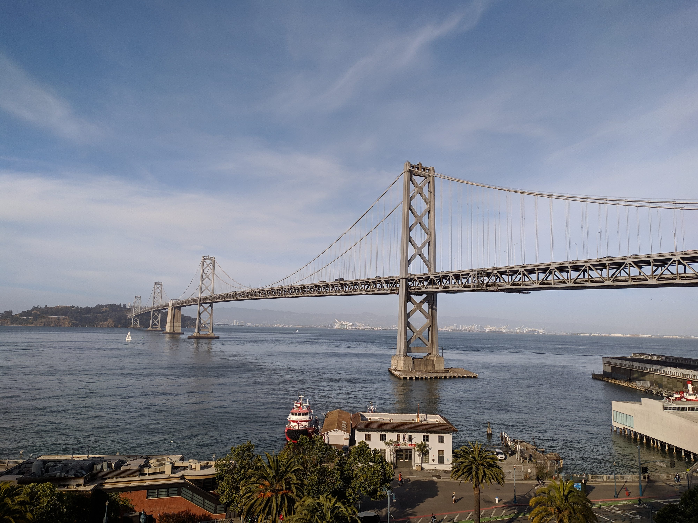
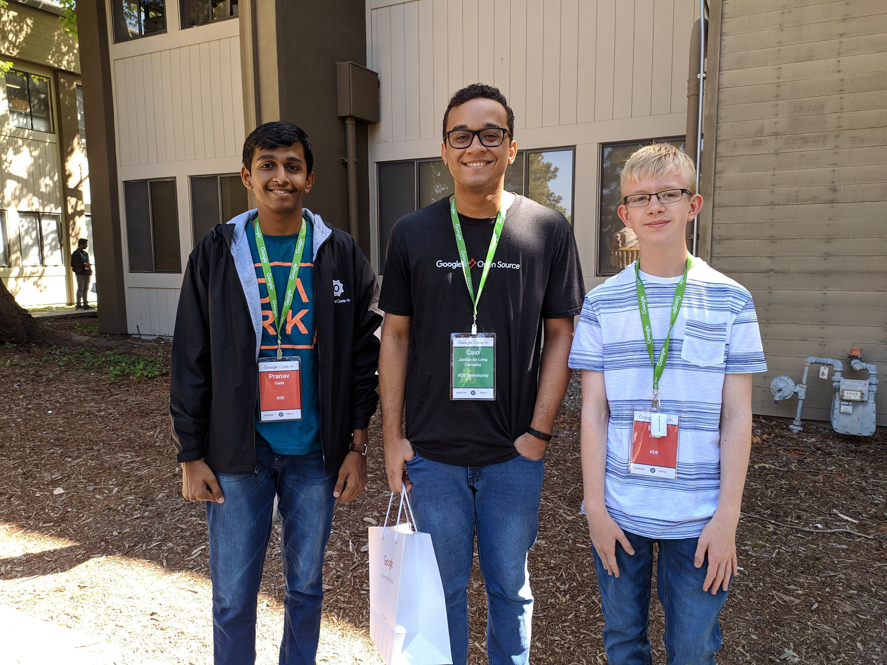
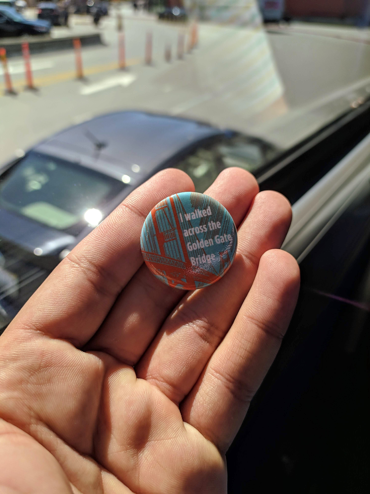

Hello!

In June, I had the opportunity to be the mentor representing KDE in the Google Code-in (GCi) 2018 trip in San Francisco, California. For those who don't know what GCi is, it is basically a competition organized by Google for students with ages between 13-17 years old that introduces them into open source contributions with some tasks involving coding, documentation, artwork, etc.

In the end of this program, each participant open source organization selects two winners based on their involvement with the community projects and the number of tasks that they have completed.  I have participated in this program as one of the mentors for the KDE community and this previous [post](https://caiojcarvalho.wordpress.com/2019/01/02/google-code-in-2018-my-first-experience-as-a-mentor-in-kde/) explains about how amazing my experience was.

The selected student winners have the opportunity to travel to the Google HQ with their family to meet Googlers, visit Google offices and have fun in SF. They can also meet some mentors from the GCi program as each open source community can select one mentor to go for this travel. The travel happened during four days (June 24-27, 2019) and there were a lot of interesting activities that I will list below.

## **June 24**

- On the first day, we had a nice welcome reception where we had some presentations from Google telling about how successful the program was in the last edition. Everyone could receive some gifts, including some nice jackets and an amazing backpack! :)

- There were also a lot of foods and, as the reception have happened in the office closer to the SF-Oakland bridge, we had the opportunity to see this amazing view:

\[caption id="attachment\_972" align="aligncenter" width="611"\] _SF-Oakland Bridge_\[/caption\]

## **June 25**

- On the second day, we have visited the Google offices in Sunnyvale and I had the opportunity to talk with our KDE students winners (Billy and Pranav) and their families about our community, open source and the GCi program.

\[caption id="attachment\_973" align="aligncenter" width="628"\] _Photo with our KDE students (Pranav at left and Billy at right)._\[/caption\]

- I also had the opportunity to meet some mentors and students from other open source communities like Apertium, Fedora, Sugar Labs, OpenWISP, PostgreSQL and others. In these meetings, I could talk to them about KDE and also know more about their projects as well, learning more about open source.
- We also had enjoyable presentations from Googlers about different topics like Tensorflow, Chrome OS, Google Assistant and other projects from the company.

## **June 26**

- This day started with a ride in the Segways through the streets of SF.

\[caption id="attachment\_974" align="aligncenter" width="548"\] _Riding a Segway through the SF bay._\[/caption\]

- Then, we went for a walk in the famous Golden Gate bridge (which is not actually golden, but #FF4F00 \[international orange\]).

\[caption id="attachment\_975" align="aligncenter" width="551"\] _Nice walk through the Golden Gate bridge._\[/caption\]

\[caption id="attachment\_976" align="aligncenter" width="500"\] _Yay!_\[/caption\]

- And in the end of the day, we sailed on a yacht and went through all the SF bay.

\[caption id="attachment\_977" align="aligncenter" width="595"\] _I have never been on a yacht before, haha._\[/caption\]

## **June 27**

- In the last day, we had some presentations from students and mentors about their communities and projects.
- I also have participated in a video recording from Google, being interviewed and answering questions about the impact of open source in my career and how it has changed my life.

\[caption id="attachment\_978" align="aligncenter" width="593"\] _It was nice to meet you, Stephanie!_\[/caption\]

And that's all folks! Thanks KDE for this great opportunity, it was amazing! I also would like to say thanks to Stephanie Taylor, Saranya Sampat, Tony Urso, Radha Jhatakia and all the Google open source team for providing this event and for encouraging our students to become great developers and contributors.
