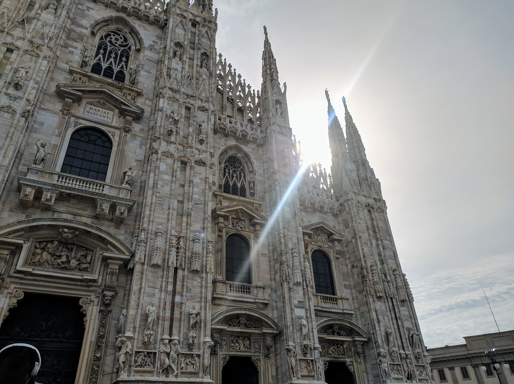

There has been some time since my last blog post. It has happened because of a good cause, since I was focusing on my undergraduate thesis. Now I have finished it and finally have completed my graduation, yay! Soon I will include my thesis on my blog and share it with the world... I have just decided to fix some details in the project before that. Anyway, this post is to comment about my participation in Akademy 2019. I will give a brief report, share my experiences and tell you about how this experience was for me.

\[caption id="attachment\_991" align="aligncenter" width="499"\] My badge!\[/caption\]

Akademy has happened during September 7th-13th, 2019. It was held at the University of Milano-Bicocca, in the beautiful city of Milan, Italy. It was my first time in Italy and I had a great impression about there, such a nice food and adorable places. My flight has arrived in the night of September 7th, which was exactly after the first day of the event.

\[caption id="attachment\_1000" align="aligncenter" width="443"\] _Duomo di Milano_\[/caption\]

I couldn't participate on the Welcome Event and watch the talks from the Day 1,  however, during the Day 2 I could watch some talks and review my presentation, which was going to happen in the same day and was going to be my first presentation in English. In the afternoon, I could present my talk, where I have explained a little about my work on kpmcore and partitionmanager, including some details about KDE Partition Manager 4.0 and our work on Google Summer of Code, Season of KDE and Google Code-in over the last two years. You can watch the full presentation here:

https://www.youtube.com/watch?v=afxHXOtxzvU

Then, in the following 5 days, we had lots of BoF sessions, workshops and meetings, where KDE contributors could discuss about topics related to the KDE ecossystem and plans for the community. On September 12th, I have decided to host a KDE Students Programs BoF with Aman, Bhushan and Valorie, where we could make some plans for Season of KDE 2020 and the next Google Summer of Code.

\[gallery ids="992,993" type="columns"\]

On September 11th, we went for a daytrip, which was in the Lake Como. Such a beautiful place! I had the opportunity to walk through some villages and places that are closer to the lake and enjoy a sunny day. Here are some pictures:

\[gallery ids="996,994,995,997,998,999" type="square"\]

Then, in September 13th, I returned to Brazil. This opportunity to participate for the second time in Akademy was really good, since I could get more involved with the community and meet again people that are involved in different KDE projects. Thanks to KDE e.V. for the help and support in this travel and also thanks to all the organizers and supporters for making this amazing conference happen.
